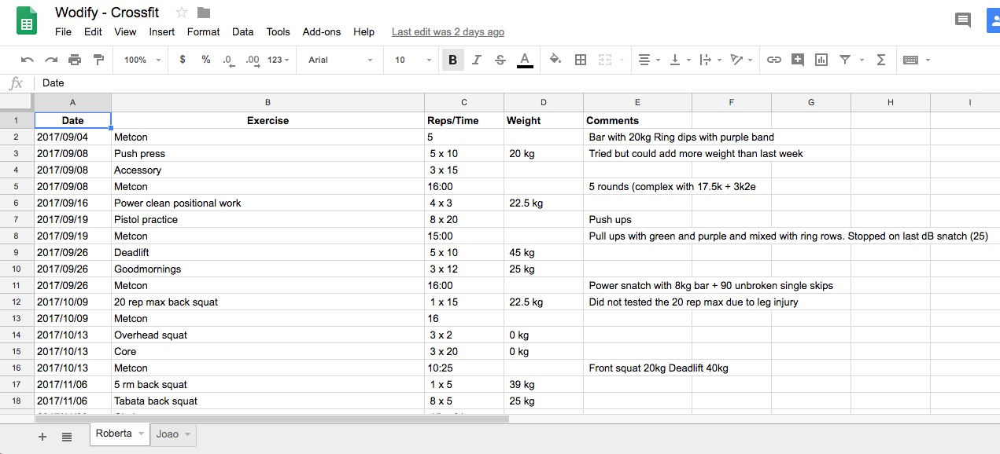

# wod2spreadsheets
This is just a simple Python Script to Push my Wodify results to a Google Spreadsheet Using Twitter.

This script was born from the fact that both me and my wife do Crossfit and we register our Wod results on the [App Wodify]([https://app.wodify.com/WodifyAdminTheme/LoginEntry.aspx) and although we can export the results, I'm a sucker for automation. 

So the app allows integration with Twitter so the only thing I needed was to scrape my account or the wife's and search for the hastag #wodify. From there on it was just a case of parsing the tweet and running this on a crontab. 

### How does it work?
The script runs every night at 1am on a crontab and checks the last day's tweets, if found it will parse the tweet and insert the results in a Google Spreadsheet. 

# Installation

Clone this repo into a folder in your server and install the required python modules.

## **Python Modules**

This is the list of Python Modules you are going to need to install:

* datetime
* tweepy
* re
* pandas
* gspread
* argparse

There's a requirements.txt file with the modules you need. Just run:

```
pip install -r requirements.txt
```

After you have these modules installed we are going to need to get both Twitter and Google Spreadsheets Credentials. 

### Twitter

Since I'm using the module Tweepy and I've used a Digital Ocean tutorial, I'm just gonna leave the link here:

* [Tweepy Authentication](https://www.digitalocean.com/community/tutorials/how-to-authenticate-a-python-application-with-twitter-using-tweepy-on-ubuntu-14-04)

When you have the details from Twitter, just add them to the wodify.py script. 

### Google Spreadsheet
We are also going to need to authenticate against Google API for the spreadsheet:

* [Gspread OAuth2](http://gspread.readthedocs.io/en/latest/oauth2.html)

_Note_: On the step of creating the Spreadsheet in the gdrive, don't forget to take note of the name, you are going to need it on the next steps, also create a sheet with your First name on your Twitter name. (**e.g:** Joao)

After you get the .json file, just add it to the folder where you have the wodify.py script or somewhere else and update the path to it.

**e.g:** authfile = ('/PATH TO AUTH FILE/gdrive.json')

### Configuring the wodify.py
There are some params in the script that need to be updated, besides the Twitter and the Gspread credentials, you are going to need to change:

```
#authfile for google drive
authfile = ('/opt/wodify/gdrive.json')

#twitter accounts to check for #wodify
listofaccounts = ["account1", "account2"]

##spreadsheet where the data will be pushed
spreadsheet = "Wodify - Crossfit" 

```

## Running it
You can run it manually or in a crontab.

### Manually
```
[20:01:13] $ ./wodify.py
Tweet: (datetime.datetime(2018, 4, 23, 7, 15, 21), u'Joao Rechena', u'#wodify Back squat: 3 x 4 @ 60 kg | Comment: 3x6 @ 55')
Columns: ['2018/04/23', u'Back squat', u' 3 x 4 ', u' 60 kg ', u' 3x6 @ 55']
Tweet: (datetime.datetime(2018, 4, 23, 20, 0, 20), u'Joao Rechena', u'#wodify Metcon: 3:55 | Comment: Kb 12 kg')
Columns: ['2018/04/23', u'Metcon', u'3:55', None, u' Kb 12 kg']
Tweet: (datetime.datetime(2018, 4, 23, 20, 0, 20), u'Joao Rechena', u'#wodify Back squat: 3 x 4 @ 37.5 kg | Comment: 3x6@35kg')
Columns: ['2018/04/23', u'Back squat', u' 3 x 4 ', u' 37.5 kg ', u' 3x6@35kg']

```

If all went good you should now have a spreadsheet called "Wodify - Crossfit" with a sheet named Joao and with the following entries:

```
['2018/04/23', u'Back squat', u' 3 x 4 ', u' 60 kg ', u' 3x6 @ 55']
['2018/04/23', u'Metcon', u'3:55', None, u' Kb 12 kg']
['2018/04/23', u'Back squat', u' 3 x 4 ', u' 37.5 kg ', u' 3x6@35kg']
```

Screenshot Example



### Crontab
If you want to run this on a crontab style just add something like:

```
0 1 * * * /opt/wodify/wodify.py
```

This will run every day at 1am and get the tweets from the previous day. 

_**Note**:_ Since the scrip is setup to get the tweets from the previous day you should run the crontab after midnight. 

# TODO
* Add a conf file for the authentication
* Tidy Up...
* etc...

